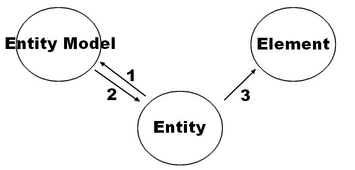

# Collision and Entities

You must distinguish between entity and element but if the concept is very similar.

* Element for the visual.
* An entity is only used to calculate the positions or collisions in the background

1. The entity called model to know the positions or collisions
2. Model returns the data
3. The entity displays the element based on the data model

## Code ##

First, initialize

    var canvas = CE.defines("canvas_id").
        extend(Hit).
        ready(function() {
            canvas.Scene.call("MyScene");
        });

Create the scene :

    
    canvas.Scene.new({
      name: "MyScene",
      ready: function(stage) {
    
    	 function addEntities(x, y) {
    		var entity = Class.New("Entity", [stage]);
    		entity.rect(100); // square
    		entity.position(x, y);
    		entity.el.fillStyle = "red";
    		entity.el.fillRect(0, 0, 100, 100);
    		stage.append(entity.el);
    		return entity;
    	 }
    
    	 this.entityA = addEntities(0, 10);
    	 this.entityB = addEntities(300, 10);
    	 
      },
      render: function(stage) {
    	this.entityA.move(5); // x += 5;
    	this.entityA.hit([this.entityB], function(state, el) {
            if (state == "over") {
    		  el.fillStyle = "green";
    		  el.fillRect(0, 0, 100, 100);
            }
    	});
    	stage.refresh();
      }
    });

1. Create an entity (#1 on the diagram)

        Class.New("Entity", [stage]);

2. Assign it a polygon (here, a square 100px)

        entity.rect(100);

3. Assign him his position

        entity.position(x, y);

4. Change its appearance (element) and place it on the stage

        entity.el.fillStyle = "red";
        entity.el.fillRect(0, 0, 100, 100);
        stage.append(entity.el);

In the `render` method :

1. Moving entity 5px in the right

        this.entityA.move(5);

2. Test the collision between two entities.

       this.entityA.hit([this.entityB], function(state, el) {
            if (state == "over") {
    		  el.fillStyle = "green";
    		  el.fillRect(0, 0, 100, 100);
            }
    	});

> You also have to test `out` if the entity is no longer in collision